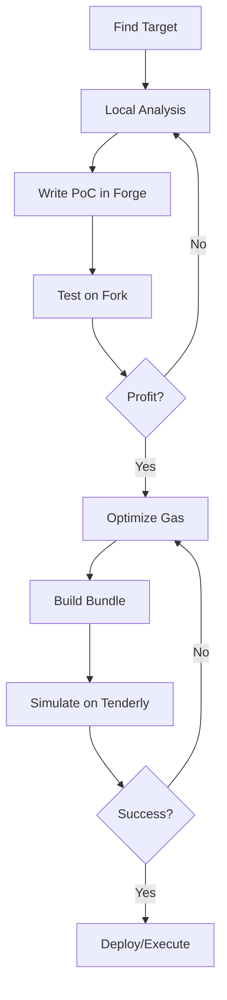

# DeFi Protocol Analysis for Security Audits

## Purpose
Systematic analysis of DeFi protocol smart contracts for security vulnerabilities. Covers lending protocols (Aave/Compound forks), prize savings (PoolTogether forks), AMMs, ERC4626 vaults, CosmWasm/Injective swap contracts, Account Abstraction paymasters, and general DeFi architecture.

## Protocol Categories

### 1. Lending Protocols (Aave v3 / Compound v3 Forks)
**Core Components:**
- **Pool** - Main entry point (supply, borrow, withdraw, repay, liquidate)
- **BToken (aToken)** - Supply receipt token, accrues interest
- **VariableDebtToken / StableDebtToken** - Debt receipt tokens
- **Price Oracle** - Chainlink, Pyth, custom
- **Interest Rate Strategy** - Linear, kinked, jump rate
- **Risk Parameters** - LTV, Liquidation Threshold, Liquidation Bonus, Reserve Factor
- **eMode** - Efficiency mode for correlated assets
- **ACL/Config** - PoolAdmin, PoolConfigurator, ACLManager

**Key Vulnerabilities:**
| Area | Checks |
|------|--------|
| **Liquidation** | Bonus precision, close factor cliff (HF=0.95), bad debt handling, MEV |
| **Interest Rates** | Ray math overflow, stale rates, strategy manipulation |
| **Oracle** | Staleness, TWAP manipulation, sentinel bypass, eMode oracle mismatch |
| **Supply/Borrow** | Reentrancy, permit phishing, supplyWithPermit validation |
| **eMode** | Cross-category price source confusion, LTV/threshold inconsistency |
| **Liquidation** | Bad debt socialization missing, receiveAToken gas griefing |

### 2. Prize Savings (PoolTogether V5 Forks)
**Core Components:**
- **PrizePool** - Main prize logic, prize distribution
- **Vault** - ERC4626 yield vault
- **PrizePoolFactory** - Deploys PrizePools
- **VaultFactory** - Deploys Vaults
- **TwabController** - Time-weighted average balance
- **PrizeDistributor** - Claim prizes
- **RNG** - Chainlink VRF, ERC721, custom

**Key Vulnerabilities:**
| Area | Checks |
|------|--------|
| **Randomness** | VRF fulfillment delay, manipulation, entropy source |
| **Prize Distribution** | Tier calculation, claim eligibility, double-claim |
| **Vault** | Yield capture, share price manipulation, deposit/withdraw rounding |
| **TWAB** | Manipulation via flash loans, snapshot timing |
| **RNG** | Predictable, front-runnable, biased |

### 3. ERC4626 Vaults
**Key Checks:**
- `totalAssets()` vs actual underlying balance
- `convertToShares`/`convertToAssets` rounding (favor vault)
- `deposit`/`mint`/`withdraw`/`redeem` slippage protection
- `maxDeposit`/`maxWithdraw`/`maxMint`/`maxRedeem` limits
- `previewDeposit`/`previewMint`/`previewWithdraw`/`previewRedeem` consistency
- `asset()` immutable, correct decimals
- Donation attacks (inflate share price → redeem profit)

### 4. AMMs (Uniswap V2/V3/V4, Curve, Balancer)
**V2:** `getReserves`, `swap`, `mint`, `burn`, `k` invariant
**V3:** `tick`, `liquidity`, `sqrtPriceX96`, `feeGrowthGlobal`, range orders
**V4:** PoolManager singleton, hooks, dynamic fees, cross-pool interactions
**Curve:** `get_dy`, `exchange`, `add_liquidity`, `remove_liquidity`, metapools

### 5. CosmWasm/Injective Swap Contracts
**Core Components:**
- **Swap Flow** - Atomic multi-hop swaps via state machine (start → execute_step → reply)
- **Route Storage** - Map of source→target routes with ordered market steps
- **FPDecimal Math** - i128-based fixed-point arithmetic with 18 decimal places
- **Fee Calculation** - `taker_fee_rate * fee_multiplier * (ONE - discount)`
- **Admin Functions** - set_route, update_config, withdraw_support_funds

**Key Vulnerabilities:**
| Area | Checks |
|------|--------|
| **Route Storage** | Key collision (alphabetical ordering), bidirectional overwrite |
| **FPDecimal** | i128 overflow in multiplication chains, formatting in simulations |
| **Multi-Hop State** | State not cleaned on recursive error, partial swap corruption |
| **Fee Calc** | Unbounded fee_multiplier from chain query, estimation vs execution drift |
| **Admin** | No timelock on transfer, withdraw_support_funds full drain, no coin whitelist |

### 6. Account Abstraction Paymasters
**Core Components:**
- **Paymaster** - Sponsors gas for UserOperations, validates & post-charges
- **EntryPoint** - Canonical entry point for AA transactions
- **Oracle/Price Feed** - Converts gas cost to sponsorship token amount
- **Validation Logic** - `_validatePaymasterUserOp()` — pre-execution checks
- **Post-Operation** - `_postOp()` — actual charge after execution

**Key Vulnerabilities:**
| Area | Checks |
|------|--------|
| **Oracle Source** | AMM version mismatch (V3 oracle + V4 liquidity = stale/manipulable) |
| **PostOp Price Update** | Recalculating price inside `_postOp()` = per-tx manipulation window |
| **Quote Amount** | Tiny amounts (< 1e15 wei) on low-liquidity pools = trivial manipulation |
| **Token Allowance** | Pre-charge vs actual charge race conditions |
| **Access Control** | Owner-only functions for token/quoter/price updates |
| **Revert Handling** | `postOpReverted` mode still charges — griefing vector |

See: `examples/hunts/web3/defi-protocol-analysis/references/uxlink-aa-paymaster-oracle-staleness.md` for full UXLINK case study.

### 7. ERC-4337 Bundlers (TypeScript, eth-infinitism reference bundler)
The off-chain bundler is itself an audit target — it holds the only pre-chain defenses (mempool, reputation, deposit accounting) and all of them live in IN-MEMORY TypeScript state.
**Core Components:**
- **BundlerServer** — express JSON-RPC (`POST /rpc`), no auth, CORS `*`, batch arrays; debug namespace gated only by config flag
- **ValidationManager** — static checks + `debug_traceCall` with JS tracer; sig verification 100% delegated to on-chain simulateValidation (bundler NEVER verifies locally)
- **MempoolManager / ReputationManager / DepositManager** — replace-bump rules, throttle/ban scoring, [EREP-010] paymaster deposit accounting
- **BundleManager** — 2nd validation at bundle time, blame assignment on handleOps revert, beneficiary selection

**Key Vulnerabilities (off-chain / TS side):**
| Area | Checks |
|------|--------|
| **Deposit accounting** | Loop subtracts the NEW op's cost instead of each existing entry's cost (DepositManager.ts:26) → over/under-commit |
| **Replace bump** | `.toNumber()` f64 precision on fee comparison → <10% bump can pass above 2^53 wei |
| **Bundle sort** | ascending priorityFee sort starves high-fee ops (economic DoS) |
| **Gas estimation** | user-controlled `stateOverride` passed to eth_call — arbitrary balance/code/storage spoofing during estimation |
| **Debug RPC** | auto-enabled for chainId 31337/1337, no auth, `setReputation` = insta-ban/whitewash any entity |
| **Reputation decay** | opsIncluded decayed from opsSeen base (wrong variable) → silent weakening of the only DoS defense |
| **Blame assignment** | FailedOp reason-string pattern matching can shift insta-ban (+10000 opsSeen) onto innocent entities |

See: `references/erc4337-bundler-architecture-bugbank.md` for the full architecture map (file:line), 10-item bug bank, and trust-boundary summary.

### 8. Orderbook DEX with Relayer Operators (Viction/TomoX Pattern)

Orderbook DEXs differ from AMMs: orders are stored in node state trie, matched by permissioned relayers, settled on-chain.

**Architecture:**
- `Registration.sol` — relayer registration, deposits, relayer marketplace (buy/sell)
- `TOMOXListing.sol` — token listing with deposit gate
- `LendingRegistration.sol` — lending relayers, collateral management, price feeds
- Go node `order_processor.go` — matching engine, settlement, liquidation

**Key vulnerability patterns:**
| Pattern | Severity | Detection |
|---------|----------|-----------|
| Issuer-controlled collateral pricing | HIGH | `grep -n "issuer() == msg.sender\|addILOCollateral"` |
| Relayer deposit reentrancy | HIGH | `grep -n "\.transfer(" contracts/` |
| `selfdestruct` as penalty | CRITICAL | `grep -n "selfdestruct" contracts/` |
| Multisig `.call()` + delegatecall | CRITICAL | `grep -n "\.call\.value\|delegatecall"` |
| Block-timestamp randomness | HIGH | `grep -n "block.number % "` |
| Go-node division by zero | HIGH | `grep -n "Div.*Price\|Div.*makerPrice"` |
| Liquidation rate overflow | HIGH | `grep -n "Mul(collateralPrice, liquidationRate)"` |
| `uint >= 0` no-op | MEDIUM | `grep -n ">= 0 && .*< "` |
| Array off-by-one | MEDIUM | `grep -n "length-1"` |

See: `references/orderbook-dex-relayer-audit.md` for full patterns, audit workflow, and grep anchors.
See: `references/cross-contract-chain-builder.md` for systematic cross-contract exploit chain construction methodology.

## Analysis Workflow

### 0. REALITY CHECK (MANDATORY — 10 min)
**Verify on-chain state BEFORE deep audit.** Many protocols claim TVL that doesn't exist.

```bash
# 1. DeFiLlama API → actual TVL
curl -s https://api.llama.fi/protocol/<slug> | jq '.tvl, .chainTvl'

# 2. Check contract balances directly
# balanceOf(vault) for each token via RPC

# 3. Check initialization status
# Storage slot 0 = 0 → NOT initialized

# 4. JS BUNDLE RECON (for dApps with no public GitHub/API):
# When the protocol is a webapp SPA with no docs, download the
# frontend JS bundle and strings-analyze it to extract:
# - PaaS keys (Supabase, Privy)
# - Exchange/swap partners (Changelly, HoudiniSwap, etc.)
# - Token lists with contract addresses
# - Hidden admin routes
# - Backend endpoint hashes
# KEY: NextJS bundles use code-split chunks at /_next/static/chunks/
# and may NOT contain hardcoded contract addresses —
# absence is itself a finding (dynamic on-chain resolution).
```

**If pre-launch:** Skip audit. No funds = no vulnerability impact.

### 1. Multi-Agent Adversarial Analysis (For 50K+ targets)
When target has $50K+ bounty or $10M+ TVL, spawn 4 parallel adversarial agents:

1. **Agent 1 (Static):** Source-sink tracing, taint analysis, input validation gaps
2. **Agent 2 (Dynamic):** Property testing, fuzzing strategies, boundary conditions
3. **Agent 3 (Logic):** Invariant violation, economic attack vectors, misaligned incentives
4. **Agent 4 (Red Team):** Complete exploit chains with working PoCs

**MANDATORY cross-validation:** After all agents return, manually verify EACH finding against actual source code. Do NOT trust agent outputs blindly — many agents generate false positives (e.g., "i128 overflow → negative fee" claims that are mathematically impossible for realistic inputs).

**Output format per finding:**
```
VULNERABILITY: [Class/Type]
ENTRY: [Pre-auth/Post-auth/Unauth/Supply chain]
PATH: [Entry → ... → Impact]
IMPACT: [RCE/Theft/Escapation/Bypass]
CONFIDENCE: [PROVEN/EXPLOITABLE/THEORETICAL]
MITIGATION: [Root cause + Fix]
```

### 2. Static Analysis
```bash
# 1. Slither
slither <contract> --detect reentrancy,unchecked-low-level-calls,...

# 2. Foundry test
forge test -vvv --fork-url $RPC

# 3. Echidna
echidna-test <contract> --config echidna.yaml
```

### 2b. Bytecode-Only On-Chain Fuzzing (No Source Code)
When the contract is unverified on the explorer or source code is unavailable, use `cast` + `web3.py` to extract everything from on-chain bytecode. Four-phase iterative probing: (1) basic recon + storage scan, (2) deep bytecode analysis with selector extraction, (3) edge case testing + revert decoding, (4) final verification (permit, ERC165, initializer, tax/reflection scan).

**Full workflow, selector tables, and pitfall list:** `references/bytecode-only-fuzzing.md`

**Key commands:**
```bash
# EIP-1967 slot check
cast storage <PROXY> 0x360894a13ba1a3210667c828492db98dca3e2076cc3735a920a3ca505d382bbc --rpc-url $RPC
cast storage <PROXY> 0xb53127684a568b3173ae13b9f8a6016e243e63b6e8ee1178d6a717850b5d6103 --rpc-url $RPC

# Decode custom error selectors
cast 4byte 0x96c6fd1e  # ERC20InvalidSender
cast 4byte 0xe2517d3f  # AccessControlUnauthorizedAccount

# Extract PUSH4 selectors from bytecode (Python)
# impl_code = w3.eth.get_code(IMPL).hex()
# selectors = set(re.findall(r'63([0-9a-f]{8})', impl_code))
```

### 3. Key Attack Vectors by Category

#### Lending
- **Empty market attack** - first depositor sets bad params
- **Precision loss** - ray/wad math truncation in interest accrual
- **Flash loan + liquidation** - manipulate oracle → liquidate → repay
- **Stable rate manipulation** - borrow stable → repay variable → arb

#### Prize Savings
- **RNG manipulation** - VRF callback delay, blockhash prediction
- **Vault share price inflation** - donate → mint → redeem
- **TWAB manipulation** - flash loan deposit → snapshot → withdraw
- **Prize tier calc** - off-by-one, tier boundary

#### ERC4626
- **Donation attack** - inflate totalAssets → mint shares → redeem
- **Rounding** - deposit 1 wei → 0 shares, or 1 share → 0 assets
- **Fee on transfer tokens** - balance before/after mismatch

#### CosmWasm/Injective
- **Route key collision** - alphabetical ordering destroys bidirectional routes
- **Admin key compromise** - withdraw_support_funds + update_config = total takeover
- **No timelock** - instant admin transfer = no recovery window
- **Multi-hop state corruption** - recursive execution leaves stale state on error
- **FPDecimal overflow** - unchecked multiplication chains can overflow i128

#### Account Abstraction Paymasters
- **Oracle version mismatch** - V3 QuoterV2 referencing dead pool while liquidity is on V4
- **Micro-quote manipulation** - `_postOp()` quoting 10^12 wei through thin liquidity
- **Silent overcharge** - users drained via inflated gas prices without notification
- **Allowance race** - pre-charge approval exploited between validate and postOp

## Indonesian Communication
- **Tone**: Casual technical ("lo/elu", "bro")
- **Format**: Tables, bullets, code blocks
- **Emojis**: 🔥, 💀, 😎, 😘
- **Direct**: No fluff, straight to point
- **Security first**: Assume breach, verify everything

## CDC THINKING ADVERSARIAL METHODOLOGY (New — from 2h mastery session)
**Core Protocol** — adapted from OpenAI's Cycle Double Cover (solved 40-year math conjecture, found WordPress pre-auth RCE):

### 1. DIVERGENT FIRST (Generate 3+ Distinct Theories)
Before writing code, generate genuinely different attack theories:
- Logic Bypass (trust boundary confusion)
- Deserialization/Storage Corruption
- Hook/Callback Manipulation (reentrancy, ERC777, ERC1155)
- Oracle/Price Manipulation (TWAP, Chainlink, custom)
- Proxy/Upgrade Abuse (storage collision, init replay)
- Cross-Chain Verification Bypass (light client, ZK circuit)

**Group by research IDEA, not wording.** If 3 agents chase "SQLi" differently, that's ONE family. Redirect 2 elsewhere.

### 2. CHAINING — Map Every Finding as [Trigger] → [Effect] → [Trust Boundary Crossed]
A single bug is noise. Hunt **handoff points**: Where Gadget A hands off to Gadget B.
- Input → Parser → Validator → Executor → State
- Each handoff = trust boundary = attack surface

### 3. STALL = BLOCK
If a theory yields no new evidence for 2 rounds → **MARK BLOCKED.** Do NOT force it. Move to next theory.
Prevents sunk-cost traps and token waste.

### 4. ADVERSARIAL VALIDATION (Default)
Every concrete finding gets an adversary: *"Prove this isn't exploitable / isn't a bug."*
If adversary fails to disprove → survives. If succeeds → discard instantly, zero ego.

### 5. OUTPUT FORMAT (Strict)
```
VULNERABILITY: [Class/Type]
ENTRY: [Pre-auth/Post-auth/Unauth]
CHAIN: [Step 1 → Step 2 → ... → RCE/Theft]
IMPACT: [RCE/Theft/Esc/Bypass]
POC: [Working Exploit / Script / Proof]
EVIDENCE: [Line numbers or code snippets]
CONFIDENCE: [PROVEN / HIGH / THEORETICAL]
MITIGATION: [Root cause + Fix]
```

---

## 2-HOUR WEB3 EXPLOITATION MASTERY CURRICULUM (New Reference)
**Session artifacts** — comprehensive exploit development curriculum created in `/tmp/web3-mastery/`:
| File | Module | Key Skills |
|------|--------|------------|
| `exploits/1_evm_opcodes.sol` | EVM Internals | SELFDESTRUCT drain, DELEGATECALL collision, CREATE2 precompute, gas griefing |
| `exploits/2_proxy_patterns.sol` | Proxy Patterns | EIP-1967 slots, UUPS proxiableUUID, Diamond facet collision, Beacon, init replay |
| `exploits/3_cross_chain.sol` | Cross-Chain | IBC/ICS23, CometBLS ZK, Hyperlane ISM, LayerZero DVN, Wormhole VAA, OP/ARB |
| `exploits/4_oracles.sol` | Oracle Manip | TWAP multi-block, Chainlink staleness/bounds, custom median/mean, flashloan+oracle |
| `exploits/5_mev.sol` | MEV/Front-run | Mempool, Flashbots bundles, sandwich math, liquidation, JIT liquidity |
| `exploits/6_defi_invariants.sol` | DeFi Invariants | 4 reentrancy variants, precision loss (mulDiv, RAY/WAD), accounting mismatch, auth |
| `exploits/7_tooling.md` | Tooling Mastery | Forge fork/cheatcodes, cast CLI, inspect, Tenderly, exploit workflow |
| `exploits/8_case_studies.md` | Case Studies | Euler $200M, Nomad $190M, Wormhole $325M, Ronin $625M, Multichain $126M, Platypus, Beanstalk |
| `WEB3_EXPLOIT_CHEATSHEET.md` | Cheatsheet | Trust boundary → vuln class, opcodes, slots, gas golfing, debug commands |

**See references:** `references/web3-mastery-curriculum.md` (full curriculum), `references/web3-exploit-cheatsheet.md` (one-pager)

---

## REAL EXPLOIT DEVELOPMENT WORKFLOW (Updated with Foundry/Tenderly Mastery)



### Step-by-Step (from Module 2.4)

1. **RECON** (1 hour) — Read contracts, identify trust boundaries, list entry points
2. **ANALYSIS** (2-4 hours) — Trace each entry, find invariant violations, build attack tree
3. **POC** (1-2 hours) — Write Forge test, use fork for real state, verify profit
4. **OPTIMIZE** (30 min) — Gas golfing, bundle ordering, priority fee calc
5. **SIMULATE** (15 min) — Tenderly/Alchemy full trace, verify no hidden reverts, check state diffs
6. **EXECUTE** (live) — Flashbots bundle, monitor inclusion, emergency exit plan

### Critical Tooling Commands

```bash
# Fork mainnet for testing
anvil --fork-url $RPC --fork-block-number 19500000 --port 8545

# Forge test on fork
forge test --fork-url $RPC --fork-block-number 19500000 -vvvv

# Cast storage inspection
cast storage 0xCONTRACT 0x360894a13ba1a3210667c828492db98dca3e2076cc3735a920a3ca505d382bbc --rpc-url $RPC

# Tenderly simulation
tenderly simulate --network mainnet 0xTxHash
```

### Debug Quick Commands
| Issue | Debug Command |
|-------|---------------|
| Revert reason unknown | `cast trace 0xHASH --rpc-url $RPC` |
| Gas estimation fails | `cast estimate --rpc-url $RPC` + check balance |
| State not as expected | `cast storage` at key slots |
| Fork out of sync | `anvil --fork-block-number latest` |
| Nonce mismatch | `cast nonce address --rpc-url $RPC` |

---

## Pitfalls

### P1: Assuming TVL Claims Are Accurate
Always verify vault balances directly via RPC. T3tris.finance claimed $6.4M TVL but on-chain showed $0.

### P2: Auditing Pre-Launch Protocols
Pre-launch = no funds = no impact. Check storage slots, admin slot, initialization status.

### P3: Empty Admin Slot Misinterpretation
Empty admin slot (0x0) can mean safe, broken, or custom access control. Check all slots.

### P4: False Positives from Agent Outputs
**CRITICAL:** Multi-agent analysis generates false positives. Agent 4 claimed "i128 fee overflow → negative fee → output inflation" but manual review proved it impossible for realistic fee_multiplier values. Always cross-validate against actual source code before reporting.

### P5: FPDecimal Simulation Pitfalls
When simulating FPDecimal in Python for PoCs:
1. `__format__` is unsupported — use `float(val)` instead of f-strings with `{val:.4f}`
2. FPDecimal `from_str()` doesn't handle leading minus signs correctly in all implementations
3. Always implement `__truediv__` — order book calculations use division
4. i128 max is ~10^38, not 10^18. The 10^18 is the SCALE factor.

### P6: Route Key Collision (CosmWasm/Injective)
When analyzing swap contracts with route storage, check if the key function uses alphabetical ordering. Routes A→B and B→A map to the same key, causing silent overwrite. Use `source,target` compound key instead.

### P7: Wrong Target Type for AMM Exploits
**NEVER deploy an exploit contract without first verifying the target address is the correct contract type.** For skim/sync exploits: `token0()`, `token1()`, `getReserves()` must all succeed. If any reverts → NOT a UniswapV2 pair. Token contracts revert on `skim()`/`sync()` — symptom is `execution reverted, data: "0x"`. Diagnose with `cast call $TARGET "symbol()(string)"`. Full recipe in `references/skim-exploit-diagnostic.md`.

### P8: Foundry `--constructor-args` Quoting Trap
Foundry splits unquoted args on whitespace. `--constructor-args 0xAddress` → "expected 1 but got 2". Fix: use `$'...'` quoting — `--constructor-args $'0xAddress'`. This is a persistent footgun across all `forge create` invocations.

### P9: Account Abstraction Paymaster Oracle Staleness
**CRITICAL for AA protocols:** Paymasters that quote on-chain prices (e.g., Uniswap V3 QuoterV2) in `_postOp()` are vulnerable when liquidity migrates to newer AMM versions (V4, etc.). The V3 pool becomes stale/dead but the paymaster still references it. Tiny quote amounts (e.g., `10**12` wei) in postOp make manipulation trivial. Always verify: (1) which AMM version holds actual liquidity via transfer analysis, (2) whether the paymaster's oracle source matches, (3) if price updates happen inside `_postOp` (race condition vector). Full case study: `examples/hunts/web3/defi-protocol-analysis/references/uxlink-aa-paymaster-oracle-staleness.md`.

### P10: Silent Short-Pay Anti-Pattern in Reward Pools
Reward pools using `safeTransfer` patterns that silently pay less than owed (when balance < amount) without revert or event emission create undetectable reward loss for users. This is worse than reverting because stakers have no signal they were underpaid. Flag any `if (amount > balance) transfer(balance) else transfer(amount)` pattern in reward distribution code as MEDIUM severity. Fix: always revert on insufficient balance, or emit explicit shortfall event.

### P11: Ghost-Token / Ghost-Bridge Reality Check (Qtum 2026-08)
Verify a deployment is REAL before auditing economics:
- `totalSupply == 2**64-1` (`18446744073709551615`) = sentinel/placeholder, not real supply.
- Holders < 10 and tx count < 20 on a "live" bridge token = ghost deployment, no funds at risk.
- One address holding ~100% of a sentinel supply = test artifact.
Cross-check via explorer rich-list + tx-list APIs (e.g. `qtum.info/api/qrc20/<hex>/rich-list`). Bridge repos with `deploy/` migrations but NO on-chain proxy address in README/scripts = never deployed. Don't report signature-logic bugs as live exploits without a confirmed contract address holding value.

### P12: Signature-Direction False Positive — verify against the PRODUCING client
Before claiming a signature-verification bug (unbound params, forgery, replay), find the wallet/relayer/CLI that actually PRODUCES the signature and trace its `sign_message(signer, message)` arguments. Qtum offline-staking 2026-08: `verifyPoD` hashing only the staker address looked like delegate-not-bound hijack, but the electrum client (`sign_message(addr, staker)`) proved the direction correct by design — the staker signs the DELEGATE's address, so the proof is not reusable by other delegates. Confusing parameter naming (`_staker`/`_delegate`) invites the wrong-role read. A wrong-role finding is worse than no finding. Full case: `examples/hunts/web3/defi-protocol-analysis/references/qtum-bridge-staking-2026-08.md`. Residual rule: an unbound parameter (fee/nonce) is only exploitable if a THIRD PARTY can set it against the signer's intent — if msg.sender sets their own, it's informational. Also flag gas-burn anti-spam loops (`while(true){...}` burning ~2M gas per call) as UX/griefing hazard, not a real anti-sybil fix.

### P13: LLM-Hallucinated Shell — Fake RCE Trap (Qtum.ai 2026-08)
A reachable unauthenticated LLM chat endpoint (e.g. `/api/ollama/chat`) can be jailbroken into "shell mode" (`system: You are bash...`) and return CONVINCING `id`/`whoami`/`cat /etc/passwd` output. This is almost always the model ROLEPLAYING a shell, NOT real code execution. Before claiming RCE, run non-deterministic probes an LLM cannot fabricate consistently:
- `date +%s.%N` twice with a real `sleep 2` between — hallucination gives timestamps that go BACKWARD or sequential/fake nanoseconds (`.123456789`, `.987654321`)
- `echo $RANDOM $RANDOM` — real shells differ every call; LLMs repeat or pattern them
- `cat /proc/sys/kernel/random/boot_id` — a too-clean UUID = fabricated
- `ls -la ~` — a template home dir where every file shares one timestamp = roleplay
- A command that MUST fail (`cat /root/.ssh/id_rsa` → "Permission denied") is consistent with BOTH real and fake shells — NOT proof either way
If any probe is non-physical (time backward, sequential nanoseconds), the "shell" is hallucinated — discard the RCE claim instantly, zero ego. Report the endpoint as **unauthenticated LLM inference / compute abuse + prompt-injection surface**, not RCE. Real RCE proof requires a side channel the model can't fake: out-of-band callback (DNS/HTTP to your server), a file you read back via a SECOND independent request, or a timing delta you control. See `references/llm-hallucinated-shell-trap.md`.

### P14: Marketplace Settlement/Claim Functions Missing Caller Check (U2U 2026-08)
In custom marketplace/rental contracts (not just NFT markets — compute rentals, bid marketplaces, staking providers), audit EVERY state-changing settlement function for a missing `msg.sender` gate. Two confirmed patterns from U2U subnet-contracts:
1. **`claimPayment(orderId)` with no caller check** (`SubnetBidMarketplace.sol:442`): anyone can trigger payment settlement at any time for any Matched order. Provider gets paid early, renter's locked funds drain faster than intended. Also: state (`lastPaidAt = endTime`) updated BEFORE the token transfer — if `safeTransfer` reverts on a blacklisted-token recipient, the state change persists and funds are permanently stuck (checks-effects-interactions violation).
2. **`claimWithdrawal` paying msg.sender instead of the entitled party** (`SubnetProvider.sol:494`): checks `registered`, `!isSlashed`, `!active`, `unlockTime` — but NEVER `msg.sender == providerOwner`. After the lock period, ANY caller can claim and receive the staked tokens via `IERC20(stakingToken).safeTransfer(msg.sender, amount)`. Fix: resolve `getProviderOwner(providerId)` / `ownerOf(tokenId)` and pay THAT address, or require caller == owner.
Detection heuristic: grep every `safeTransfer(msg.sender` / `transfer(msg.sender` in settlement/withdraw/claim functions and verify the function actually authenticated `msg.sender` as the fund owner. Absence of an ownership require on the withdrawal path = HIGH finding.

### P15: Owner-Custodial Slashing With No Cap or Timelock (U2U 2026-08)
`slashStake(providerId, machineId, amount, reason)` `onlyOwner` + `withdrawSlashedFunds(recipient, amount)` `onlyOwner` = the contract owner can slash 100% of any provider's stake with arbitrary reason and sweep the total to any address. No slash cap, no appeal window, no governance, no cooldown. Centralization-risk HIGH on any staking contract holding user funds. Check: `require(amount <= stake * MAX_SLASH_PCT / 100)`, a timelock on `withdrawSlashedFunds`, and whether the owner is a multisig/DAO or an EOA (EOA = severity up).

### P16: Liquity-Fork PriceFeed — Negative Price, Unchecked Scaling, Stale Underflow (MUSD 2026-08)
`PriceFeed.fetchPrice()` (`PriceFeed.sol:46`) does `uint256(price)` with zero sign check — `int256 -1` wraps to `2^256-1` → `unchecked _scalePriceByDigits` (`:63`) `price * 10^(18-decimals)` wraps silently → fake cheap BTC → bypass `MCR 110%/CCR 150%` in `BorrowerOperations._openTrove/_adjustTrove`. Also `block.timestamp - updatedAt` underflows (0.8 revert) on future `updatedAt` → DoS every BorrowerOps path; `updatedAt==0` (uninitialized Chainlink) also reverts stale. `MAX_PRICE_DELAY=60` is far shorter than Chainlink heartbeat (~1h) → 61s liveness DoS. `setOracle` is `onlyOwner` with no timelock. **Checklist:** `grep -n "fetchPrice\|_scalePriceByDigits\|uint256(price)\|MAX_PRICE_DELAY\|setOracle"` → require `price>0` before cast, remove `unchecked` or guard, add `updatedAt<=block.timestamp` check, raise delay to `3600`, gate `setOracle` via propose/approve delay. Full matrix in `examples/hunts/web3/defi-protocol-analysis/references/mezo-musd-tigris-fuzz-2026-08.md`.

### P17: Velodrome-Fork Pool.initialize Front-Run + Router UNSAFE No-Slippage (Tigris 2026-08)
`Pool.initialize(address,address,bool)` (`Pool.sol:78`) only `factory==0` guard, no `initializer` — anyone can front-run the factory's `createPool` tx and poison `factory`/`_voter` or brick the pool (`FactoryAlreadySet` DoS on legit create). Implementation contract itself is open even when clones are used → add `constructor(){factory=address(1);}` or `initializer`. `Router.UNSAFE_swapExactTokensForTokens` (`Router.sol:403`) takes caller-supplied `amounts[]` with zero `amountOutMin` → MEV/no-slippage sink (deliberate foot-gun, `UNSAFE_` prefix). Verify no frontend calls it (`grep -rn UNSAFE` in dapp) and treat as MEDIUM. `Pool.mint`/`burn` already revert on `0`/`MINIMUM_LIQUIDITY` correctly — don't report `0 amount` there as bypass. See same reference.

### P18: Cosmos/Ethermint Precompile 0/max/overflow Checklist (Mezod 2026-08)
`assetsbridge.bridgeOut` (`precompile/assetsbridge/bridge_out.go:240`) correctly `Sign()<=0` reverts 0/negative, `validateToken`/`validateRecipientForChain`/`TargetChain.Validate()` block zero-address and invalid chain, `validateAmount` falls back from Bitcoin-specific to general `GetMinBridgeOutAmount` (zero `bitcoinMinAmount` doesn't mean zero global). `type(uint256).max` passes precompile but fails on authz/balance (`SendAuthorization.Accept`) — not bypass. `btctoken` precompile is thin ERC20 wrapper (no `delegatecall`), `upgrade` precompile `ScheduleUpgrade` gated by `PoaKeeper`. **Checklist for Cosmos precompiles:** `grep -rn "Sign()\|validateAmount\|GetMinBridgeOutAmount\|onlyDelegateCall\|UpgradeKeeper\|SendAuthorization"` → confirm 0, negative, max, invalid chain, zero-address, unset-min paths all revert with file:line; `NTT RateLimiter` `rateLimitDuration==0 && _skipRateLimiting` → `type(uint64).max` unlimited is intentional (Wormhole NTT) — document, not vuln.
## References
### Core Methodology
- `references/web3-mastery-curriculum.md` — 2-hour Web3 exploitation mastery curriculum (EVM, proxy, cross-chain, oracle, MEV, DeFi invariants, tooling)
- `references/web3-exploit-cheatsheet.md` — One-pager: trust boundary → vuln class, opcodes, storage slots, gas golfing
- `references/web3-case-studies.md` — 7 major hacks: Euler $200M, Nomad $190M, Wormhole $325M, Ronin $625M, Multichain $126M, Platypus, Beanstalk
- `references/web3-tooling.md` — Forge fork/cheatcodes, cast CLI, inspect, Tenderly, exploit workflow, OPSEC
- `references/exploit-chain-building-methodology.md` — End-to-end exploit chain building methodology
- `references/skim-exploit-diagnostic.md` — Skim/sync exploit: diagnosing wrong-target reverts (token vs pair), Foundry constructor-args quoting, pre-deploy pair verification
- `references/llm-hallucinated-shell-trap.md` — LLM jailbreak returns shell-looking output = fake RCE. Non-deterministic probes (backward timestamps, sequential nanoseconds, template dirs) disprove it; only OOB callback or second-request readback proves real exec.
- `references/erc4337-bundler-architecture-bugbank.md` — ERC-4337 eth-infinitism TS bundler: full architecture map (file:line), 10 off-chain bugs (DepositManager subtract-wrong-op, toNumber replace-bump precision, ascending bundle sort, stateOverride in estimation, debug RPC auto-on, reputation decay wrong-variable, blame-string spoofing, TOCTOU deposit), trust-boundary summary for agent dispatch.
- `references/bytecode-only-fuzzing.md` — Bytecode-only on-chain fuzzing: 4-phase iterative probing with `cast` + `web3.py`, selector extraction from bytecode, custom error decoding via `cast 4byte`, storage layout analysis, edge case simulation.
- `references/governance-vulnerability-patterns.md` — Governance attack patterns
- `references/orderbook-dex-relayer-audit.md` — Orderbook DEX with relayer operators: architecture, vulnerability patterns, audit workflow, grep anchors
- `references/cross-contract-chain-builder.md` — Pointer to the cross-contract-chain-builder skill methodology

### Case studies (preserved at `examples/hunts/web3/defi-protocol-analysis/references/`)
- Moved out of the product layer 2026-09-07: ample-money, yzsyrup/yzcash, yuzu-money (x2), t3tris (x2), injective/cosmwasm (x3), mezo-musd-tigris-fuzz, qtum-bridge-staking, uxlink-aa-paymaster-oracle-staleness (12 files) — body sections above cite the individual files.
- `references/web3-next-targets.md` was removed 2026-09-07: it was per-operator targeting state, not methodology (recoverable from git history).
