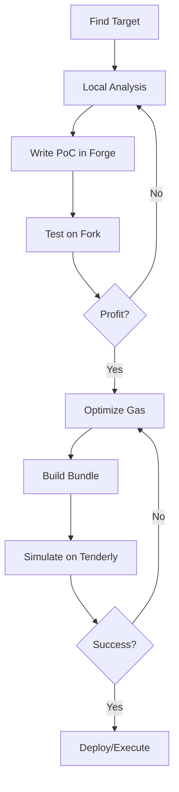

# MODULE 2.4: MAINNET FORK TESTING & TOOLING MASTERY
## Practical tooling for real exploit development

---

### 1. FOUNDRY FORK TESTING

```bash
# Start Anvil fork
anvil --fork-url https://eth-mainnet.g.alchemy.com/v2/$KEY \
      --fork-block-number 19500000 \
      --port 8545 \
      --chain-id 1 \
      --balance 1000000000000000000000000  # 100k ETH for testing

# Or in Forge test
forge test --fork-url $RPC_URL --fork-block-number 19500000 -vvvv
```

#### Forge Cheatcodes (vm.*)

```solidity
// Fork setup
vm.createFork(rpcUrl);                    // Create fork, returns forkId
vm.selectFork(forkId);                    // Switch fork
vm.rollFork(forkId, blockNumber);         // Roll fork to specific block

// State manipulation
vm.deal(address who, uint256 amount);     // Give ETH
vm.deal(address token, address who, uint256 amount); // Give ERC20
vm.store(address contract, bytes32 slot, bytes32 value); // Direct storage write
vm.load(address contract, bytes32 slot);  // Read storage
vm.etch(address contract, bytes code);    // Replace contract code
vm.prank(address sender);                 // Next call from sender
vm.startPrank(address sender);            // All calls from sender
vm.stopPrank();                           // Stop prank
vm.label(address addr, string name);      // Label in traces
vm.expectRevert(bytes error);             // Expect revert
vm.expectEmit(...);                       // Expect event

// Time manipulation
vm.warp(uint256 newTimestamp);            // Set block.timestamp
vm.roll(uint256 newBlockNumber);          // Set block.number
vm.difficulty(uint256 newDifficulty);     // Set block.difficulty

// EVM inspection
vm.getCode(address);                      // Get runtime code
vm.getNonce(address);                     // Get nonce
vm.getBalance(address);                   // Get ETH balance
```

#### Real Exploit Test Template

```solidity
// SPDX-License-Identifier: MIT
pragma solidity ^0.8.20;

import "forge-std/Test.sol";

contract RealExploitTest is Test {
    // Mainnet addresses
    address constant UNISWAP_V2_ROUTER = 0x7a250d5630B4cF539739dF2C5dAcb4c659F2488D;
    address constant USDC = 0xA0b86a33E6441c8C06DD4486c3C284E5a3763336;
    address constant WETH = 0xC02aaA39b223FE8D0A0e5C4F27eAD9083C756Cc2;
    
    // Attacker with 1000 ETH
    address attacker = makeAddr("attacker");
    
    function setUp() public {
        // Fork mainnet at specific block
        vm.createFork("https://eth-mainnet.g.alchemy.com/v2/$KEY");
        // Or use --fork-url in command line
        
        // Give attacker ETH
        vm.deal(attacker, 1000 ether);
        
        // Impersonate whale for tokens
        address usdcWhale = 0x...;
        vm.startPrank(usdcWhale);
        IERC20(USDC).transfer(attacker, 1_000_000 * 1e6);
        vm.stopPrank();
    }
    
    function test_SandwichAttack() public {
        vm.startPrank(attacker);
        
        // 1. Simulate victim swap (we know it's coming)
        // In real: detect in mempool
        
        // 2. Build front-run
        // ... swap logic
        
        // 3. Execute bundle
        // In test: just execute sequentially
        // In prod: send to Flashbots
        
        // 4. Verify profit
        uint256 balBefore = address(this).balance;
        // ... exploit
        uint256 balAfter = address(this).balance;
        
        console.log("Profit:", balAfter - balBefore);
        assertGt(balAfter, balBefore);
        
        vm.stopPrank();
    }
}
```

---

### 2. CAST - COMMAND LINE EVM TOOL

```bash
# Read storage
cast storage 0xContractAddress 0xSlotNumber --rpc-url $RPC

# Read multiple slots
cast storage 0xContractAddress 0 1 2 3 --rpc-url $RPC

# Call view function
cast call 0xContractAddress "balanceOf(address)" 0xWhaleAddress --rpc-url $RPC

# Send transaction (with private key)
cast send 0xContractAddress "transfer(address,uint256)" 0xTo 1000000000000000000 \
     --private-key $PK --rpc-url $RPC

# Estimate gas
cast estimate 0xContractAddress "function(args)" --rpc-url $RPC

# Get transaction trace
cast trace 0xTxHash --rpc-url $RPC

# Get block info
cast block 19500000 --rpc-url $RPC

# Convert units
cast --to-wei 1 ether
cast --from-wei 1000000000000000000 eth
cast --to-bytes32 "0x1234"
cast --calldata "transfer(address,uint256)" 0xTo 1000000000000000000

# Deploy contract
cast send --create 0xBytecode --private-key $PK --rpc-url $RPC
```

---

### 3. FORGE INSPECT - STATIC ANALYSIS

```bash
# Storage layout
forge inspect ContractName storageLayout

# Function selectors
forge inspect ContractName selectors

# Bytecode size
forge inspect ContractName bytecode

# Assembly
forge inspect ContractName assembly

# Interface
forge inspect ContractName interface
```

#### Storage Layout Output Example

```json
{
  "storage": [
    {
      "astId": 1,
      "contract": "ContractName",
      "label": "owner",
      "offset": 0,
      "slot": "0",
      "type": "t_address"
    },
    {
      "astId": 2,
      "label": "balances",
      "offset": 0,
      "slot": "1",
      "type": "t_mapping(t_address, t_uint256)"
    }
  ],
  "types": {
    "t_address": {"encoding": "inplace", "label": "address", "numberOfBytes": "20"},
    "t_mapping(t_address, t_uint256)": {
      "encoding": "mapping",
      "key": "t_address",
      "value": "t_uint256"
    }
  }
}
```

---

### 4. TENDERLY / ALCHEMY SIMULATION

```bash
# Tenderly CLI
tenderly login
tenderly push --project=my-project --username=me

# Simulate transaction
tenderly simulate --network mainnet 0xTxHash

# Fork and test
tenderly fork create --network mainnet --block 19500000
tenderly fork simulate <fork-id> --from 0xAttacker --to 0xTarget --input 0xCalldata
```

#### Simulation Benefits
- Full state diff (storage changes, balance changes)
- Gas profiling per opcode
- Event emission trace
- Revert reason decoding
- No private key needed

---

### 5. CUSTOM CHEATCODES FOR EXPLOITS

```solidity
// SPDX-License-Identifier: MIT
pragma solidity ^0.8.20;

import "forge-std/Test.sol";

contract ExploitCheatcodes {
    // Impersonate any address
    function impersonate(address who) internal {
        vm.startPrank(who);
    }
    
    // Give ETH + tokens
    function fund(address who, address token, uint256 amount) internal {
        vm.deal(who, 100 ether);
        if (token != address(0)) {
            vm.deal(token, who, amount);
        }
    }
    
    // Snapshot / revert for iterative testing
    function snapshot() internal returns (uint256) {
        return vm.snapshot();
    }
    
    function revertTo(uint256 snap) internal {
        vm.revertTo(snap);
    }
    
    // Fast-forward time
    function advanceTime(uint256 seconds) internal {
        vm.warp(block.timestamp + seconds);
        vm.roll(block.number + seconds / 12); // ~12s per block
    }
    
    // Deploy with CREATE2 deterministic address
    function deployCreate2(bytes memory bytecode, bytes32 salt) 
        internal returns (address) {
        address addr;
        assembly {
            addr := create2(0, add(bytecode, 0x20), mload(bytecode), salt)
        }
        return addr;
    }
    
    // Compute CREATE2 address
    function computeCreate2(address deployer, bytes32 salt, bytes memory bytecode) 
        internal view returns (address) {
        return address(uint160(uint256(keccak256(abi.encodePacked(
            bytes1(0xff), deployer, salt, keccak256(bytecode)
        )))));
    }
    
    // Mock ERC20 for testing
    function mockERC20(string name, string symbol, uint8 decimals) 
        internal returns (address) {
        // Deploy minimal ERC20 with mint/burn
    }
}
```

---

### 6. REAL EXPLOIT WORKFLOW



#### Step-by-Step

1. **RECON** (1 hour)
   - Find protocol, read contracts
   - Identify trust boundaries
   - List all entry points

2. **ANALYSIS** (2-4 hours)
   - Trace each entry point
   - Find invariant violations
   - Build attack tree

3. **POC** (1-2 hours)
   - Write Forge test
   - Use fork for real state
   - Verify profit

4. **OPTIMIZE** (30 min)
   - Gas golfing
   - Bundle ordering
   - Priority fee calc

5. **SIMULATE** (15 min)
   - Tenderly/Alchemy full trace
   - Verify no hidden reverts
   - Check state diffs

6. **EXECUTE** (live)
   - Flashbots bundle
   - Monitor inclusion
   - Emergency exit plan

---

### 7. DEBUGGING COMMON ISSUES

| Issue | Debug Command |
|-------|---------------|
| Revert reason unknown | `cast trace 0xTxHash --rpc-url $RPC` |
| Gas estimation fails | `cast estimate --rpc-url $RPC` + check balance |
| State not as expected | `cast storage` at key slots |
| Fork out of sync | `anvil --fork-block-number latest` |
| Nonce mismatch | `cast nonce address --rpc-url $RPC` |
| Token approval | `cast call token "allowance(address,address)" owner spender` |

---

### 8. OPSEC FOR EXPLOITERS

```bash
# Use fresh RPC endpoints (not shared)
# Rotate wallets per exploit
# Use Flashbots Protect for private mempool
# Never test on mainnet without fork first
# Clear bash history: history -c
# Use hardware wallet for signing bundles
# Monitor for frontrunning of your own exploits
```

---

### 9. ESSENTIAL REPOS TO STUDY

```bash
# Real exploit PoCs
git clone https://github.com/sunsec/DeFiHackLabs
git clone https://github.com/yoouou/DeFi-Attacks
git clone https://github.com/barbrad/eth-exploits

# Tooling
git clone https://github.com/foundry-rs/foundry
git clone https://github.com/crytic/slither
git clone https://github.com/trailofbits/echidna

# MEV
git clone https://github.com/flashbots/mev-share-node
git clone https://github.com/flashbots/builder
```